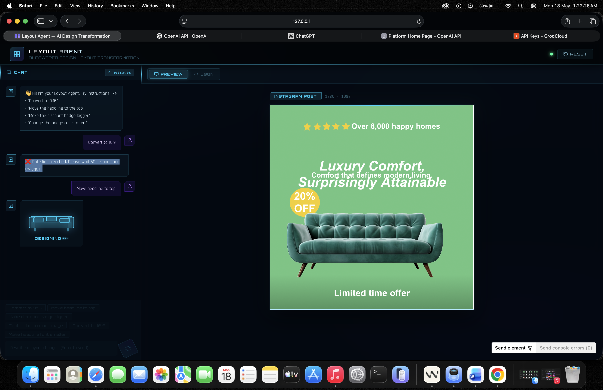
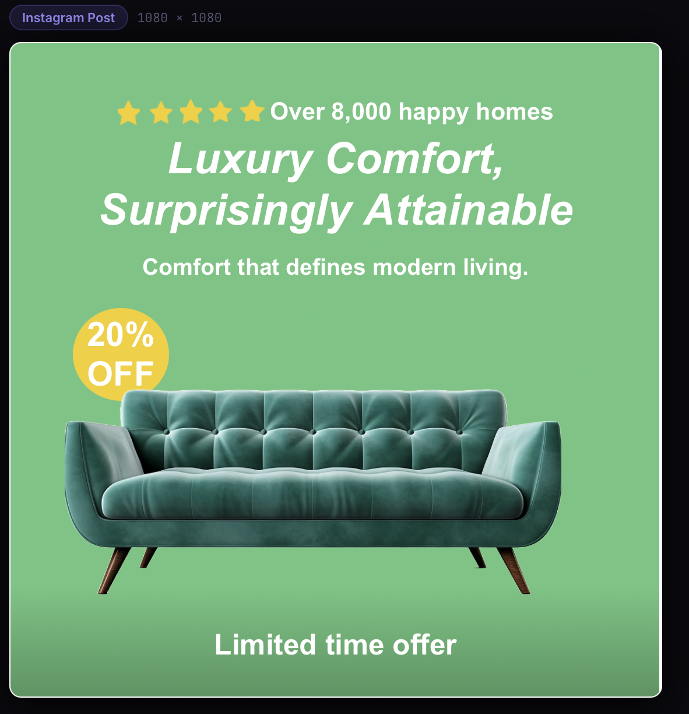

# Layout Agent — AI-Powered Design Layout Transformation

## 🚀 Live Demo

> **[➡ Click here to open the live app](https://sad-olives-change.loca.lt)**
>
> If prompted for a tunnel password, visit [loca.lt/mytunnelpassword](https://loca.lt/mytunnelpassword) on your device, copy the IP shown, and paste it into the password box.

---

> Chat with your design canvas. Modify furniture & sofa advertisement layouts using plain English, powered by Google Gemini AI.

---

## ⚠️ Important: Gemini API & Rate Limits

This project uses the **Google Gemini 2.0 Flash** model via the **free tier** of Google AI Studio.

### Free Tier Limits
| Limit | Value |
|---|---|
| Requests per minute (RPM) | 15 |
| Requests per day (RPD) | 1,500 |
| Tokens per minute (TPM) | 1,000,000 |

### What happens when the limit is hit?
The app **automatically retries** — you do not need to do anything.
- Hit 1 → waits **15 seconds**, retries silently
- Hit 2 → waits **30 seconds**, retries silently
- Hit 3 → waits **60 seconds**, retries silently

The sofa loading animation stays on screen during retries. Only if all 3 retries fail will an error message appear.

### Getting your own free API key
1. Go to [aistudio.google.com](https://aistudio.google.com)
2. Sign in with a Google account
3. Click **"Get API key"** → **"Create API key"**
4. Copy it and paste it into `server/.env` as shown below

> **Note:** The free tier is sufficient for normal demo and assignment usage. At 1,500 requests/day you can comfortably run this project for weeks without upgrading.

---

## Before / After

See how a single chat instruction transforms the sofa ad layout in real time:

| Before | After |
|:---:|:---:|
|  |  |
| Original layout with default element positions | AI-transformed: headline moved to top, badge repositioned |

---

## Approach

This project uses a **hybrid LLM + code** strategy to transform design layouts via natural language.

### How it works
1. **User types an instruction** (e.g. "Move the headline to the top") in the chat panel
2. The **Express backend** receives the current layout JSON + conversation history + instruction
3. For **geometric operations** (e.g. aspect ratio conversion), deterministic math in `layoutTransforms.js` runs first — guaranteed correctness, no LLM needed
4. For **semantic operations** (move, recolor, resize named elements), **Gemini 2.0 Flash** reasons about which node to modify and returns an updated layout JSON
5. The response is **validated** by `jsonValidator.js` before ever reaching the frontend — invalid LLM output never corrupts the layout state
6. The **React frontend** updates the wireframe preview and JSON viewer live

### Key design decisions
- **Stateless server** — the full layout JSON travels with every request; no server-side session needed
- **Compact system prompt** — the layout JSON is embedded per-request so the LLM always has fresh context
- **Auto-retry on rate limits** — if Gemini returns a 429, the server silently retries up to 3× (15s → 30s → 60s backoff)
- **Conversation context** — last 3 turns sent with each request so follow-ups like *"make it bigger"* resolve correctly

> Full breakdown of trade-offs and engineering decisions → [`APPROACH.md`](./APPROACH.md)

---

## Walkthrough

> 🎥 **Loom video walkthrough:** _[Add your Loom link here]_
>
> The walkthrough covers:
> - Live demo of chat-driven layout transformation
> - How the sofa ad updates in real time from natural language instructions
> - Code overview of the LLM prompt, validation, and retry logic

---

## What it does

Layout Agent lets you talk to your design canvas. Send natural language instructions like *"Move the headline to the top"*, *"Make the discount badge bigger"*, or *"Change the sofa color to blue"* — and watch the layout JSON and wireframe preview update live.

---

## Prerequisites

- **Node.js v18+**
- **npm v9+**
- A **free Google Gemini API key** → [aistudio.google.com](https://aistudio.google.com)

---

## Setup

```bash
# 1. Clone the repo
git clone https://github.com/AkulaSaiMeghamsh1830/Layout-Chatbot-Agent-.git
cd Layout-Chatbot-Agent-

# 2. Set up the backend
cd server
npm install

# 3. Create your .env file
echo "GEMINI_API_KEY=your_key_here" > .env
# Replace your_key_here with your actual Gemini API key

# 4. Start the backend
npm start                   # runs on http://localhost:3001

# 5. Set up the frontend (open a new terminal)
cd ../client
npm install
npm run dev                 # runs on http://localhost:5173
```

Open **http://localhost:5173** in your browser.

---

## Example Prompts

| Instruction | What it does |
|---|---|
| `"Move the headline to the top"` | Repositions the main title text node |
| `"Make the discount badge bigger"` | Scales up the circle + 20% OFF text together |
| `"Change the badge color to coral"` | Recolors the yellow offer circle |
| `"Center the product image"` | Horizontally centers the product photo |
| `"Make the headline font smaller"` | Reduces fontSize on the largest text |
| `"Move it down a bit"` | Uses conversation context to adjust last target |

---

## Tech Stack

| Layer | Tool |
|---|---|
| Frontend | React + Vite |
| Styling | Vanilla CSS (futuristic neon / glassmorphism) |
| Backend | Node.js + Express |
| LLM | Google Gemini 2.0 Flash (free tier) |
| HTTP client | Axios |

---

## Project Structure

```
layout-agent/
├── server/
│   ├── index.js                  # Express entry point
│   ├── .env                      # GEMINI_API_KEY goes here (not committed)
│   ├── routes/chat.js            # POST /api/chat
│   ├── prompts/systemPrompt.js   # Compact system prompt builder
│   ├── services/
│   │   ├── llmService.js         # Gemini API call + auto-retry backoff
│   │   └── layoutTransforms.js   # Coordinate math helpers
│   └── utils/jsonValidator.js    # Response validation
└── client/
    └── src/
        ├── App.jsx               # Main 2-column layout
        ├── App.css               # Futuristic neon UI design system
        ├── data/initialLayout.json
        ├── hooks/useLayoutAgent.js
        └── components/
            ├── ChatWindow.jsx    # Messages + sofa loading animation
            ├── ChatInput.jsx     # Input + quick prompt chips
            ├── WireframePreview.jsx
            └── JsonViewer.jsx
```
